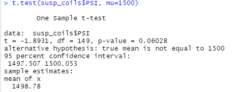

# AutosRUs MechaCar Prototype: Statistical Analysis

## Linear Regression to Predict MPG

- **Which variables/coefficients provided a non-random amount of variance to the mpg values in the dataset?**
  - Based on the individual p values we obtained for each independent variable from our multiple linear regression, the variables that provide a significant impact on the dependent variable, miles per gallon (mpg), were **vehicle_length** and **ground_clearance**. 
  - We determined this by comparing the p-values for each independent variable to the significance level. It was not explicitly stated, but if we assume a normal significance level (alpha) of 0.05, then the p-values for both vehicle length and ground clearance are less than the significance level. 

- **Is the slope of the linear model considered to be zero? Why or why not?**
  - No, the slope of the linear model is not zero for our linear models of the relationship between vehicle length and ground clearance on miles per gallon (mpg). We have determined that there is a significant relationship between these 2 independent variables (vehicle length and ground clearance) and the dependent variable (mpg).  
  - To understand this, we must review both our null and alternate hypotheses that can be stated as follows: 
    - **H0:** The slope of the linear model is zero, or m = 0. (Stated differently, if there was no significant linear relationship between our dependent and independent variables, it would mean that each dependent value would occur at random and the linear model would be a flat line.)
    - **HA:** The slope of the linear model is not zero, or m != 0. 
  - If we compare our p-values for vehicle length and ground clearance to the significance level of 0.05 (Normal), we have p-values of .00000000000260 and .0000000521 respectively. 
  - Based on these p-values compared with our significance level, we can reject the null hypothesis in this case since both are less than the significance level. Therefore, the slope of these linear models is not zero (HA). 
 
- **Does this linear model predict mpg of MechaCar prototypes effectively? Why or why not?**
  - To determine how well our linear model can be used to predict mpg for future MechaCar prototypes, we can determine and evaluate the coefficient of determination, also known as the r-squared value. 
  - At first glance, our r-squared value of 0.7149 seems to indicate that our linear model is a good predictor of mpg for future MechaCar prototypes. However, only 2 of the 5 independent variables indicated significant impact on our dependent variable of mpg. This raises the possibility of overfitting and the need to refine our linear model to more accurately make predictions for future MechaCar prototypes.  

## Summary Statistics on Suspension Coils

The MechaCar Suspension_Coil.csv dataset contains the results from multiple production lots. In this dataset, the weight capacities of multiple suspension coils were tested to determine if the manufacturing process is consistent across production lots. 

- **Statistical Summary:** 

Below are the **summary statistics** of the weight capacities (in PSI) for all 150 suspension coils **across all manufacturing lots:** 

The following are the **summary statistics** for weight capacities (in PSI) for the suspension coils **grouped by lot number:** 

- The **design specifications** for the MechaCar suspension coils dictate that the **variance of the suspension coils must not exceed 100 pounds per square inch.**
- Based on our statistical analysis, we are asked to answer the following: 
  - **Does the current manufacturing data meet this design specification for all manufacturing lots in total and each lot individually? Why or why not?**

- **Discussion:**  
  - Statistical analysis is often concerned with variance and how things vary from the average or mean in the real world. The variance provides an actual value for how much the numbers in our data set vary from the mean. Higher numbers indicate greater variability. The full definition of variance is the average of the squared distances from the mean. Because of this, the units of variance are squared (i.e. PSI squared). This makes it difficult to interpret the actual value of the variance against our suspension coil data.  
  - Therefore, it may be more useful to use the standard deviation to answer this question. The standard deviation tells us about the spread or average distance that a value lies from the mean. It is the square root of the variance such that the units will match the original units of our data (PSI).  

- **Conclusion:**
  - Yes, the current manufacturing data meet the design specifications for all manufacturing lots. The standard deviation for all lots is 7.89 PSI which is well within the defined specifications. 
  - Yes, the current manufacturing data also meet the design specifications for each individual lot. 
    - The standard deviation for Lot 1 was approximately 1 PSI, within defined limits of 100 PSI.
    - The standard deviation for Lot 2 was 2.73 PSI, also within defined limits of 100 PSI. 
    - The standard deviation for Lot 3 was 13.05 PSI, also within defined limits of 100 PSI.  
  
## T-Tests on Suspension Coils

The next section of our analysis will utilize t-tests to evaluate our sample mean versus a presumed population mean (mu = 1500 PSI). 

Our null and alternative hypothoses can be stated as follows: 
- **H0:** There is no statistical difference between the observed sample mean and the presumed population mean. 
- **HA:** There is a statistical difference between the observed sample mean and the presumed population mean.

- **Mean of All Lots versus Population Mean (Mu = 1500 PSI)**

- Conclusion: Assuming our significance level is the common 0.05 percent, our p-value is greater than our significance level. Therefore, we do not have sufficient evidence to reject the null hypothesis and can determine that the mean of our sample across all lots of suspension coils versus the population mean are statistically similar. 

- **Mean of Lot 1 versus Population Mean (Mu = 1500 PSI)**

- Conclusion: Assuming our significance level is the common 0.05 percent, our p-value is greater than our significance level. Therefore, we do not have sufficient evidence to reject the null hypothesis and can determine that the mean of our sample (i.e. Lot 1 of suspension coils) versus the population mean are statistically similar.

- **Mean of Lot 2 versus Population Mean (Mu = 1500 PSI)**

- Conclusion: Assuming our significance level is the common 0.05 percent, our p-value is greater than our significance level. Therefore, we do not have sufficient evidence to reject the null hypothesis and can determine that the mean of our sample (i.e. Lot 2 of suspension coils) versus the population mean are statistically similar.

- **Mean of Lot 3 versus Population Mean (Mu = 1500 PSI)**

- Conclusion: Assuming our significance level is the common 0.05 percent, our p-value is less than our significance level. Therefore, we have sufficient evidence to reject the null hypothesis and can determine that the mean of our sample for Lot 3 suspension coils is statistically different than the population mean (mu = 1500 PSI). 

## Study Design: MechaCar vs Competition

- Due to multiple contributing factors such as residual pandemic-related global supply chain issues and the war in the Ukraine, inflation and the high price of gas are in the headlines on a daily basis. In addition, we are confronted with the effects of climate change every day and improved fuel efficiency could help limit additional adverse effects of fossil fuels on the environment. 
- Based on these economic and environmental factors, I would propose to AutosRUs to conduct a study comparing the **fuel efficiency of MechaCar prototypes to our competitors.** 
  - Proposed study metrics/Data need to run the statistical test: 
    - Fuel efficiency measures the distance a motor vehicle can travel on a single gallon of gas and relies on a number of factors. We could begin our evaluation by measuring the miles per gallon based on the number of cylinders in the vehicle being studied.  
    - **Independent Variable:** Number of Cylinders (Data Type: Categorical)
    - **Dependent Variable:** Miles per Gallon (Data Type: Continuous)
  - **Statistical Testing Method:** 
   - We would conduct a **one-way ANOVA** statistical test to evaluate our hypothesis given that our independent variable is categorical data while our dependent variable is continuous. 
     - **H0:** There is no statistical difference in the mean miles per gallon between our sample and presumed population.  
     - **HA:** There is a statistical difference in the mean miles per gallon between our sample and presumed population.  
